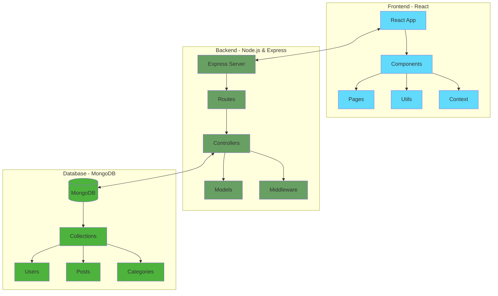
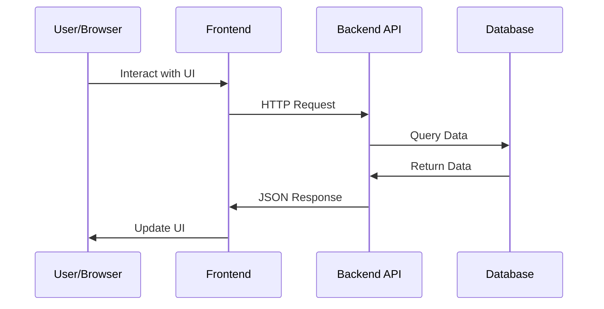

# MERN Blog Platform

A modern, full-stack blogging platform built with the MERN (MongoDB, Express.js, React, Node.js) stack. This platform allows users to create, read, update, and delete blog posts, with features like user authentication, admin dashboard, and category management.

## Architecture



## Data Flow



## Features

- 🔐 User Authentication (JWT)
- 📝 Create and Edit Blog Posts
- 🏷️ Category Management
- 👤 User Profiles
- 🎨 Responsive Design
- 🔍 Search Functionality
- 📱 Mobile-Friendly Interface
- 👑 Admin Dashboard

## Tech Stack

- **Frontend:**
  - React.js
  - React Router DOM
  - Axios
  - CSS Modules
  - Font Awesome Icons

- **Backend:**
  - Node.js
  - Express.js
  - MongoDB
  - Mongoose
  - JWT Authentication
  - bcrypt

## Getting Started

### Prerequisites

- Node.js (v14 or higher)
- MongoDB
- npm or yarn

### Installation

1. Clone the repository:
```bash
git clone https://github.com/yourusername/mern-blog.git
cd mern-blog
```

2. Install backend dependencies:
```bash
cd backend
npm install
```

3. Install frontend dependencies:
```bash
cd frontend
npm install
```

4. Create a `.env` file in the backend directory:
```env
PORT=5000
MONGODB_URI=your_mongodb_uri
JWT_SECRET=your_jwt_secret
```

5. Create a `.env` file in the frontend directory:
```env
VITE_API_URL=http://localhost:5000/api
```

### Running the Application

1. Start the backend server:
```bash
cd backend
npm run dev
```

2. Start the frontend development server:
```bash
cd frontend
npm run dev
```

## Project Structure

```
mern-blog/
├── frontend/
│   ├── src/
│   │   ├── components/
│   │   ├── pages/
│   │   ├── utils/
│   │   ├── App.jsx
│   │   └── main.jsx
│   ├── public/
│   └── package.json
│
└── backend/
    ├── controllers/
    ├── models/
    ├── routes/
    ├── middleware/
    ├── config/
    ├── server.js
    └── package.json
```

## API Endpoints

### Authentication
- `POST /api/auth/register` - Register new user
- `POST /api/auth/login` - Login user
- `GET /api/auth/profile` - Get user profile

### Posts
- `GET /api/posts` - Get all posts
- `GET /api/posts/:id` - Get single post
- `POST /api/posts` - Create new post
- `PUT /api/posts/:id` - Update post
- `DELETE /api/posts/:id` - Delete post

### Categories
- `GET /api/categories` - Get all categories
- `POST /api/categories` - Create new category
- `PUT /api/categories/:id` - Update category
- `DELETE /api/categories/:id` - Delete category

## Contributing

1. Fork the repository
2. Create your feature branch (`git checkout -b feature/AmazingFeature`)
3. Commit your changes (`git commit -m 'Add some AmazingFeature'`)
4. Push to the branch (`git push origin feature/AmazingFeature`)
5. Open a Pull Request

## License

This project is licensed under the MIT License - see the [LICENSE](LICENSE) file for details.

## Acknowledgments

- [React Documentation](https://reactjs.org/)
- [MongoDB Documentation](https://docs.mongodb.com/)
- [Express.js Documentation](https://expressjs.com/)
- [Node.js Documentation](https://nodejs.org/)

## Contact

Your Name - [@yourtwitter](https://twitter.com/yourtwitter) - email@example.com

Project Link: [https://github.com/yourusername/mern-blog](https://github.com/yourusername/mern-blog) 